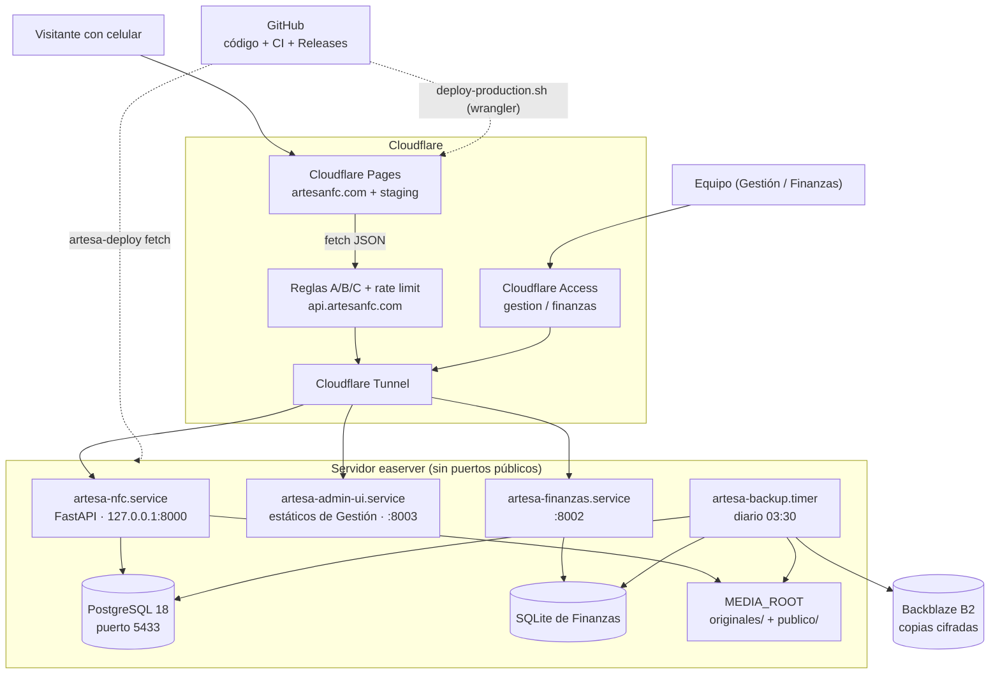
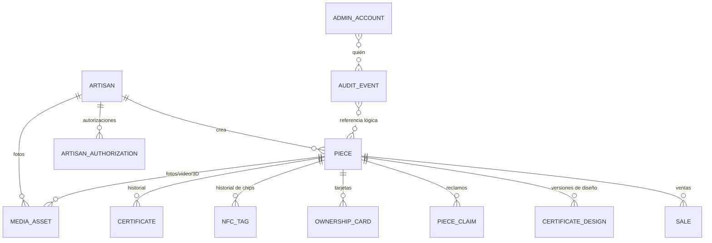
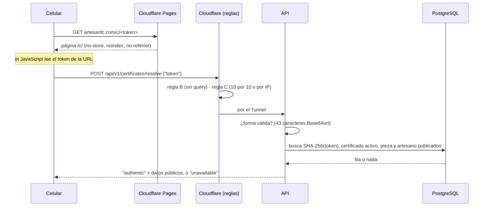

# Cómo funciona ArtesaNFC — documentación técnica completa

Este documento explica el sistema completo, **bloque por bloque y módulo por
módulo**: qué hace cada pieza, dónde vive y **por qué está ahí**, es decir, qué
problema real resuelve cada decisión. Está escrito para que cualquier persona
del equipo lo entienda aunque nunca haya abierto el código. Si sabes programar,
cada sección dice el archivo exacto que hay que leer para ir más a fondo.

**Corte:** 2026-10-07. **Código descrito:** `origin/main` `4180818` (release
R29, desplegado el 2026-10-06; Alembic `b7e2c5a9d41f`). **Repositorio:** 431
archivos versionados, 342 commits desde el 2026-09-02, 238 pull requests.

**Qué está verificado y qué no.** Todo lo que se dice del **repositorio** se
comprobó leyendo el código en ese commit. Del **servidor** (sección 14), lo
marcado **[verificado 2026-10-07]** se comprobó en vivo con comandos de solo
lectura (`systemctl is-active`, `artesa-deploy status`, `artesa-backup status`,
`df`, `uptime`). Lo marcado **[runbook]** sale de los documentos fechados
(`docs/DEPLOYMENT.md`, `docs/BACKUP.md`, `docs/OPERATIONS.md`) y del Brain, sin
comprobación en vivo.

Documentos relacionados en este repositorio: `RESUMEN_EJECUTIVO.md` (versión
de 3 minutos), `ARCHITECTURE.md`, `API_CONTRACT.md`, `DATA_MODEL.md`,
`SECURITY.md`, `DECISIONS.md` (30 ADR), `DEPLOYMENT.md`, `BACKUP.md`,
`OPERATIONS.md`, `MEDIA.md`, `PROVISIONING.md`. El Brain (`Artesa_Brain/`)
guarda la historia, los hallazgos y los pendientes.

## Índice

1. [ArtesaNFC en un minuto](#1-artesanfc-en-un-minuto)
2. [Glosario](#2-glosario)
3. [Mapa general: qué corre y dónde](#3-mapa-general-qué-corre-y-dónde)
4. [El repositorio, carpeta por carpeta](#4-el-repositorio-carpeta-por-carpeta)
5. [Backend: arranque y configuración](#5-backend-arranque-y-configuración)
6. [Backend: la base de datos, tabla por tabla](#6-backend-la-base-de-datos-tabla-por-tabla)
7. [Backend: la API, ruta por ruta](#7-backend-la-api-ruta-por-ruta)
8. [Backend: los servicios, módulo por módulo](#8-backend-los-servicios-módulo-por-módulo)
9. [Flujos de punta a punta](#9-flujos-de-punta-a-punta)
10. [Gestión (`admin/`)](#10-gestión-admin)
11. [Sitio público (`web/`) y el frontend anterior (`frontend/`)](#11-sitio-público-web-y-el-frontend-anterior-frontend)
12. [Seguridad, todo junto](#12-seguridad-todo-junto)
13. [Releases y despliegue (`backend/ops/`)](#13-releases-y-despliegue-backendops)
14. [El servidor (`easerver`)](#14-el-servidor-easerver)
15. [Respaldos (D10)](#15-respaldos-d10)
16. [Finanzas (repositorio aparte)](#16-finanzas-repositorio-aparte)
17. [CI, pruebas y QA](#17-ci-pruebas-y-qa)
18. [Historia del proyecto](#18-historia-del-proyecto)
19. [Limitaciones conocidas y pendientes](#19-limitaciones-conocidas-y-pendientes)
20. [Estado del proyecto: barras de avance](#20-estado-del-proyecto-barras-de-avance)

---

## 1. ArtesaNFC en un minuto

**El problema.** Una pieza artesanal de Oaxaca (por ejemplo, una máscara
tallada en Cuilápam de Guerrero) compite contra copias industriales. El
comprador no tiene forma rápida de saber cuál es auténtica, así que regatea
hacia el precio de la copia.

**La solución.** Cada pieza lleva un **chip NFC** escondido. Al acercar el
celular, se abre el **certificado** de esa pieza: quién la hizo, de dónde es,
con qué materiales, su historia y sus fotos. Además, quien la compra recibe una
**tarjeta con una clave secreta** bajo una capa rasca: con esa clave ve el
**certificado original**, diseñado por el equipo y aprobado por el artesano, y
puede **reclamar** la pieza como suya.

**Las cuatro superficies del sistema:**

| Superficie | Dirección | Para quién | Qué es |
|---|---|---|---|
| Sitio público | `artesanfc.com` | Cualquier visitante | Home, artesanos, piezas y la página del certificado |
| API | `api.artesanfc.com` | El sitio público (por detrás) | El "cerebro": lee y valida todo contra la base de datos |
| Gestión | `gestion.artesanfc.com` | Solo el equipo, con login | El panel donde se captura contenido, se diseñan certificados y se graban chips |
| Finanzas | `finanzas.artesanfc.com` | Solo el equipo, con login | El libro contable del proyecto (repositorio aparte) |

---

## 2. Glosario

| Término | Significado |
|---|---|
| **NFC** | Comunicación de campo cercano: el chip que el celular lee al acercarlo (a unos 2–4 cm). |
| **NTAG213** | El modelo de chip que se usa hoy. Guarda una URL. Es barato, pero **se puede clonar** (ver §12). |
| **Token** | Texto aleatorio de 43 caracteres grabado en el chip, dentro de la URL `artesanfc.com/c/<token>`. Es la "llave" que identifica el certificado. |
| **Hash** | Huella digital de un dato (SHA-256 o scrypt). La base guarda la huella, nunca el dato original; con la huella no se puede reconstruir el secreto. |
| **Certificado genérico** | El que ve cualquiera que escanea el chip: datos públicos de la pieza con su paleta de colores. |
| **Certificado original** | El diseñado y aprobado por el artesano; solo se ve con la clave de la tarjeta. |
| **Tarjeta del comprador** | Tarjeta impresa con una clave de 10 caracteres (`K7QM-4XHT-9R`) bajo una capa rasca. |
| **Reclamar** | El primer dueño registra su correo y un PIN de 6 dígitos; desde entonces la tarjeta sola no basta. |
| **Custodio** | Rol de Gestión que puede emitir certificados, grabar chips e imprimir tarjetas. |
| **Diseñador / Editor / Dueño** | Los otros roles de Gestión (ver §5.4). |
| **Publicación** | Estado de un artesano o pieza: `draft` (borrador), `published` (público) o `archived` (archivado). |
| **Release** | Un paquete inmutable y verificado del backend, construido por CI a partir de un commit de `main`. Se nombran R1…R29. |
| **Migración (Alembic)** | Un cambio versionado al esquema de la base de datos. |
| **Cloudflare** | El servicio que está delante de todo: HTTPS, reglas de firewall, límite de peticiones, Pages (hospedaje del sitio), Access (login) y Tunnel. |
| **Tunnel** | Conexión saliente del servidor hacia Cloudflare. Gracias a ella, el servidor no abre ningún puerto a Internet. |
| **Access** | El login de Cloudflare que protege Gestión y Finanzas (por correo). |
| **ADR** | *Architecture Decision Record*: una decisión de diseño escrita, con contexto y alternativas (`docs/DECISIONS.md`). |
| **Brain** | `Artesa_Brain/`, la bóveda de Obsidian con la memoria del proyecto: historia, hallazgos, riesgos y pendientes. |
| **D10** | El sistema de respaldos cifrados (issue #126). |
| **N-08** | El sistema de releases inmutables, nacido de un incidente (§13.1). |

---

## 3. Mapa general: qué corre y dónde



**Cómo leer el diagrama:**

- El **sitio** (`artesanfc.com`) son archivos estáticos en Cloudflare Pages. No
  vive en el servidor: si el servidor se apaga, el sitio sigue abriendo y
  muestra "Volvemos en un momento".
- Todo lo **dinámico** (artesanos, piezas, certificados) lo pide el navegador
  a la **API**, que corre en el servidor detrás del Tunnel.
- **Gestión** y **Finanzas** solo son alcanzables pasando por **Access**
  (login por correo).
- Los **respaldos** salen cifrados del servidor hacia Backblaze B2.

**Por qué el sitio y la API van separados** (ADR-017, ADR-018): el sitio
estático es gratis, rápido y casi imposible de tirar; la API es la única que
toca la base de datos. Si la API falla, la parte informativa del sitio sigue
en pie.

---

## 4. El repositorio, carpeta por carpeta

```text
artesa-nfc/
├── backend/          FastAPI + PostgreSQL: la API, la base de datos y las herramientas de operación
│   ├── app/          el código de la aplicación (≈11 000 líneas)
│   │   ├── main.py       punto de entrada: crea la app, middlewares y rutas
│   │   ├── core/         configuración, login de Access, errores, archivos de media
│   │   ├── db/           conexión a la base y datos demo (seed)
│   │   ├── models/       12 tablas (SQLAlchemy)
│   │   ├── schemas/      formas de entrada/salida de la API (Pydantic)
│   │   ├── api/v1/       API pública
│   │   ├── api/admin/    API de Gestión
│   │   ├── services/     la lógica de negocio (16 módulos)
│   │   └── cli/          provision.py: la CLI de certificados y chips
│   ├── alembic/      12 migraciones del esquema
│   ├── ops/          herramientas de release, despliegue y respaldo (≈7 000 líneas, solo biblioteca estándar)
│   ├── tests/        1 199 pruebas automatizadas (≈692 de la app, ≈507 de ops)
│   ├── nginx/        configuración de referencia, NO desplegada
│   └── Dockerfile, docker-compose.yml   solo para desarrollo local
├── admin/            Gestión: React 19 + Vite + Tailwind 4 (≈6 000 líneas)
├── web/              sitio público: Astro 7 + islas React (≈8 500 líneas; producción desde 2026-10-03)
├── frontend/         sitio anterior en HTML/JS puro; se conserva solo para rollback
├── qa/               QA reproducible: ruta privada, simulacros de respaldo, inventario de BD
├── docs/             22 documentos canónicos + plantillas
├── Artesa_Brain/     memoria del proyecto (Obsidian; no versionado en git)
└── .github/          5 flujos de CI + Dependabot
```

**Regla de oro del repositorio** (`CLAUDE.md`): `docs/` es la fuente de
verdad. Si el código y los documentos no coinciden, se reporta; no se adivina.
Ramas: `main` (producción) ← `develop` (integración) ← `feature/*`, `fix/*`,
`docs/*`, `chore/*`, `security/*`. Nunca se fusiona directo a `main` desde una
rama de trabajo.

---

## 5. Backend: arranque y configuración

### 5.1 `app/main.py`: el punto de entrada

Este archivo crea la aplicación FastAPI y le pone **capas** (middlewares) que
envuelven cada petición. El orden importa: la última capa agregada es la más
externa. De afuera hacia adentro:

| # | Capa | Qué hace | Por qué |
|---|---|---|---|
| 1 | `MediaFilesMiddleware` | Responde `/media/...` directamente desde el disco | Las fotos públicas no necesitan pasar por la lógica de la app (§5.6) |
| 2 | `CORSMiddleware` | Solo deja que el navegador llame a la API desde orígenes permitidos (`https://artesanfc.com`), solo `GET` y `POST`, sin cookies | Evita que otro sitio use la API desde el navegador de un visitante |
| 3 | `AdminNoStoreMiddleware` | Pone `Cache-Control: no-store` en todo `/api/admin/*` | Nada de Gestión debe quedar en caché de un navegador o proxy |
| 4 | `ResolveNoStoreMiddleware` | `no-store` en las rutas que llevan secretos (resolve, unlock, claim, revisiones, autorizaciones) | Un certificado o una clave nunca se guardan en caché |
| 5 | `ResolveBodySizeLimitMiddleware` | Rechaza con `413` cualquier cuerpo de más de 1024 bytes en esas mismas rutas | Uvicorn no limita el tamaño del cuerpo; sin esto, una sola petición enorme podría llenar la memoria. Cuenta los bytes conforme llegan, no confía en el encabezado `Content-Length` |

Después registra los **manejadores de errores** (§5.5) y monta los routers:
la API pública (`/api/v1`) y todos los de Gestión (`/api/admin/v1`). El orden
de los routers de Gestión también importa: `POST /pieces/{id}/designs` va antes
que la ruta genérica `POST /pieces/{id}/{acción}`, porque si no, "designs" se
interpretaría como una acción desconocida.

**`/health`.** Responde `200 {"status":"ok"}` si puede hacer `SELECT 1` contra
la base y `503` si no. Nunca dice por qué falló (no filtra host ni usuario),
nunca se cachea y acepta `HEAD` para los monitores. Desde Internet está
bloqueado por la regla A de Cloudflare: es solo para uso interno.

**Sin documentación interactiva en producción.** `/docs`, `/redoc` y
`/openapi.json` solo existen con `APP_ENV=local` o `test`. En producción no se
desactivan con una regla: **no existen**, son un 404 normal.

### 5.2 `app/core/config.py`: la configuración

Lee las variables de entorno (en producción, de `shared/.env`) y **se niega a
arrancar** si algo es inseguro. Variables:

| Variable | Obligatoria | Qué controla |
|---|---|---|
| `APP_ENV` | Sí | `local`, `test`, `staging` o `production`. Sin alias ("prod" falla) |
| `DATABASE_URL` | Sí | La base de datos. Sin valor por defecto: si falta, la app no arranca |
| `DEBUG` | No | Debe ser `false` en producción, o no arranca |
| `CORS_ALLOWED_ORIGINS` | No | En producción debe incluir `https://artesanfc.com` |
| `ADMIN_ACCESS_TEAM_DOMAIN`, `ADMIN_ACCESS_AUD`, `ADMIN_EMAILS` | Las tres o ninguna | Activan Gestión. Sin ellas, `/api/admin/*` responde 404 |
| `CUSTODIAN_EMAILS`, `DESIGNER_EMAILS`, `OWNER_EMAILS` | No | Roles. Cada correo debe estar también en `ADMIN_EMAILS` |
| `CUSTODY_ACCESS_AUD` | No | Segunda aplicación de Access, solo para Custodia |
| `ACCESS_SYNC_*` (3) | No | Sincronizar las cuentas de Gestión con un grupo de Access |
| `MEDIA_ROOT` | No | Carpeta absoluta con `originales/` y `publico/`. Sin ella, `/media/` da 404 y las subidas 503 |

**Por qué "fallar cerrado".** Un error de configuración que deja arrancar la app
es peor que uno que la detiene: el primero se descubre cuando ya hizo daño. Por
eso, un correo de Custodio que no esté en `ADMIN_EMAILS` impide arrancar (pasó
en producción el 2026-10-03 por un correo sin `.com`, y se detectó al
instante).

### 5.3 `app/core/db_safety.py`: que nadie toque la base equivocada

Un solo lugar con las reglas de "¿es seguro usar esta base de datos?",
compartido por la app, el seed de demo, la CLI de provisioning y las pruebas:

- En `staging`/`production` se rechazan la URL de desarrollo y las
  contraseñas de ejemplo (`change-me`, `artesanfc`).
- El seed de demo solo corre en `local`/`test` y contra una base claramente no
  productiva.
- Las pruebas exigen una base cuyo nombre contenga `test`.
- Los mensajes de error **nunca** incluyen la URL ni la contraseña. Usa un
  `RuntimeError` a propósito: Pydantic repite el valor de entrada en los
  `ValueError`, y eso filtraría la contraseña.

### 5.4 `app/core/access.py`: quién eres en Gestión

Cloudflare Access pone delante de Gestión un login por correo y firma cada
petición con un **JWT** en el encabezado `Cf-Access-Jwt-Assertion`. La API **no
confía** en que la petición pasó por Access; verifica el JWT ella misma:

1. Descarga las llaves públicas del equipo de Access (con caché de 1 hora).
2. Comprueba la firma RS256, la audiencia (AUD), el emisor y la expiración.
3. Comprueba que el correo esté en `ADMIN_EMAILS` o sea una cuenta activa
   creada desde Gestión.
4. Calcula los roles.

| Rol | Puede | Incluye |
|---|---|---|
| **Editor** | Capturar y publicar contenido, subir media, ventas | — |
| **Diseñador** | Además, diseñar certificados y registrar la aprobación del artesano | Editor |
| **Custodio** | Además, emitir certificados, grabar chips, imprimir tarjetas, revocar | Diseñador |
| **Dueño** | Además, administrar las cuentas (página Usuarios) | Custodio |

Respuestas: sin token, `401`; correo no autorizado, `403`; Access caído, `503`.
Solo se lee el **encabezado**, nunca la cookie: un sitio malicioso puede hacer
que el navegador mande cookies, pero no puede inventar ese encabezado.

### 5.5 `app/core/errors.py` y `db_errors.py`: errores que no filtran nada

- **Un solo formato de error** para toda la API:
  `{"error": {"code": "...", "message": "..."}}`. Los mensajes del framework
  ("Not Found") se reemplazan por los canónicos.
- **PostgreSQL mete valores de filas en sus mensajes de error** (en la columna
  `DETAIL`). En la tabla `certificate`, eso incluye `token_hash`. Por eso
  `db_errors.py` atrapa todas las excepciones de base de datos con un manejador
  específico y responde un error genérico. El texto original nunca llega al log
  del servidor. Además, un filtro de logging descarta los tracebacks que
  contienen errores de base de datos.

### 5.6 `app/core/media_files.py`: servir fotos sin abrir el disco

Sirve `/media/...` desde `MEDIA_ROOT/publico/`, pero solo rutas con la forma
exacta que escribe el servicio de subida:
`{artesanos|piezas|sitio}/{slug}/{nombre}.{jpg|webp|avif|png|mp4|webm|glb}`.
Cualquier otra cosa (`..`, archivos ocultos, `originales/`, otras extensiones)
es 404 **antes de tocar el disco**. Además:

- El archivo resuelto debe seguir dentro de `publico/` y ser un archivo normal,
  no un enlace simbólico que apunte afuera.
- Caché de un año (`immutable`): un archivo publicado nunca cambia; una versión
  nueva lleva otro nombre.
- `Access-Control-Allow-Origin: *` solo aquí, porque el visor 3D descarga el
  modelo `.glb` con CORS.
- Solo se aceptan rangos de bytes simples (`bytes=a-b`), los que Safari
  necesita para reproducir video. Los rangos múltiples se ignoran: tuvieron una
  vulnerabilidad de rendimiento en Starlette.

### 5.7 `app/db/`: conexión y datos demo

- `base.py`: crea el motor de SQLAlchemy con `hide_parameters=True`, para que
  los valores (por ejemplo, un `token_hash`) nunca aparezcan en los logs.
- `session.py`: `check_database_connection()`, usado por `/health`, con un
  límite de 2 segundos.
- `seed.py`: datos demo ficticios (3 artesanos, 4 piezas) con UUID
  deterministas. Es idempotente (correrlo dos veces da el mismo resultado) y
  aborta si un slug ya pertenece a un registro real. Solo corre en
  `local`/`test`.

### 5.8 Dependencias del backend

Fijadas a una versión exacta en `requirements.txt`. Producción instala desde
`requirements-prod.lock`, con **hash** de cada paquete:

| Paquete | Para qué |
|---|---|
| `fastapi` 0.141 + `uvicorn` 0.34 | Servidor web y framework |
| `sqlalchemy` 2.0 + `psycopg` 3.2 | Acceso a PostgreSQL |
| `alembic` 1.14 | Migraciones |
| `pydantic-settings` 2.7 | Configuración |
| `pyjwt` + `cryptography` | Verificar el JWT de Access |
| `pillow` 12.3 | Procesar fotos subidas |
| `pytest` + `httpx` | Pruebas (nunca llegan a producción) |

Python 3.14 en producción. No hay más dependencias: los hashes de claves usan
`hashlib.scrypt` de la biblioteca estándar.

---

## 6. Backend: la base de datos, tabla por tabla

PostgreSQL es la **única fuente de verdad**. El esquema actual tiene 12 tablas
de la aplicación, más la tabla de control de Alembic.



**Patrón que se repite en casi todas las tablas:** las filas viejas **no se
borran**, cambian de estado (revocado, reemplazado, cancelado) y quedan como
historia. Para garantizar que solo haya **una fila vigente** por pieza, se usan
**índices únicos parciales** (por ejemplo, "único `piece_id` donde
`status = 'active'`"). Así, la regla la hace cumplir la base de datos misma,
aunque el código tuviera un error.

### 6.1 `artisan`: el artesano

Datos públicos: `slug` (único; va en la URL), `full_name`, `artistic_name`,
`locality`, `municipality`, `state` (por defecto Oaxaca), `country`,
`languages` (y si se muestran), `biography`, `history`, `techniques`,
`public_contact`.
Datos privados (solo Gestión): `validation_whatsapp` y
`validation_contact_name`, el número al que se mandan los enlaces de
aprobación (puede ser de un familiar que le muestra el enlace al artesano).
Estado: `publication_status` (`draft`/`published`/`archived`) y `trashed_at`
(si está en la Papelera).

### 6.2 `piece`: la pieza

- **Identidad:** `slug` (único), `public_code` (único, por ejemplo
  `ANFC-6AJA2J`; se imprime en la tarjeta) y `artisan_id`. Si el artesano
  tiene piezas, no se puede borrar (`RESTRICT`).
- **Contenido:** `name`, `description`, `history`, `technique`, `materials`,
  `origin`, `creation_year`/`creation_date`, `dimensions` y `visual_theme` (la
  paleta del certificado).
- **Estados:** `availability_status` (`available`, `reserved`, `exhibited`,
  `archived`, `sold`; `sold` solo se pone al registrar una venta) y
  `publication_status`.
- **Otros:** `trashed_at`, `reported_stolen_at` (si un Custodio la reportó
  robada) y `price_cents` + `price_currency` (precio en centavos para que las
  sumas no tengan errores de redondeo; nunca sale en la API pública).

**Regla de publicación** (`api/v1/common.py`): una pieza es pública **solo si
ella y su artesano** están publicados. Todas las consultas públicas usan
exactamente la misma función para que la regla no pueda divergir.

### 6.3 `certificate`: el certificado

| Columna | Significado |
|---|---|
| `token_hash` | SHA-256 del token. **El token en claro nunca se guarda** |
| `status` | `draft` → `active` → `revoked` |
| `issued_at`, `revoked_at`, `revocation_reason` | Fechas y motivo |
| `version` | Sube con cada rotación |
| `authenticity_metadata` | JSON. Hacia afuera solo se expone `notes` |

Reglas de la base: `token_hash` es nulo solo en `draft`; `revoked_at` existe
solo si está revocado; **un solo certificado activo por pieza** (índice parcial).

### 6.4 `nfc_tag`: el chip físico

Estados: `available` → `programmed` (grabado) → `locked` (bloqueado contra
reescritura) → `replaced`/`retired`. Guarda `chip_model`, `frequency`,
`protocol`, `physical_uid` (número de serie del chip, único), `programmed_at`,
`locked_at` y `notes`.
**El UID no es un secreto ni sirve para autenticar** (cualquier lector lo lee):
es solo inventario. Reglas: un chip grabado o bloqueado debe tener pieza; un
solo chip activo por pieza; `locked_at` se conserva aunque después se
reemplace el chip.

### 6.5 `media_asset`: fotos, video y 3D

`media_type` (`image`, `video`, `model_3d`, `sequence_360`), `role` (`hero`,
`gallery`, `detail`, `process`, `portrait`, `document`, …), `storage_path`,
`alt_text` (**obligatorio en imágenes**, por accesibilidad), `position`,
`format_metadata` y `status` (`active`/`archived`). Pertenece a un artesano o a
una pieza, nunca a los dos.

### 6.6 `audit_event`: la bitácora que no se puede borrar

Registra quién hizo qué y cuándo: `occurred_at`, `actor_type`, `actor_email`,
`entity_type`/`entity_id`, `action`, `result`, `ip_address` y `metadata`.
**Solo se agregan filas:** la migración instala un *trigger* que rechaza
`UPDATE`, `DELETE` y `TRUNCATE`, así que ni la propia aplicación puede
reescribir la historia. Además sirve para contar intentos fallidos por IP al
desbloquear certificados.

### 6.7 `ownership_card` y `piece_claim`: la tarjeta y el reclamo (ADR-030)

- **`ownership_card`:** `key_hash` (scrypt con sal), `status` (`active`,
  `blocked`, `replaced`), `failed_attempts`, `locked_until`. Una sola tarjeta
  vigente por pieza. Pertenece a la **pieza**, no al chip: cambiar el chip no
  invalida la tarjeta del dueño.
- **`piece_claim`:** `owner_email`, `pin_hash` (scrypt) y `status`
  (`active`/`released`). Un solo reclamo activo por pieza.

### 6.8 `certificate_design`: el certificado original diseñado

Una fila por **versión**. Flujo: `draft` → `in_review` (con el artesano) →
`approved` → `published` → `superseded`. Guarda `template` y `params` (paleta,
motivo, textos, frase del artesano, semilla del patrón), el hash del token de
revisión con su expiración, el comentario de "pedir cambios", y quién aprobó,
cuándo, por qué medio y con qué nota.
Reglas: solo un borrador se edita; las versiones aprobadas o publicadas **se
congelan** (un rediseño crea la versión siguiente); máximo una versión abierta
y una publicada por pieza.

### 6.9 `sale`: la venta (P-026)

`sold_on`, `price_cents`, `currency`, `channel` (`taller`, `tienda`,
`en_linea`, `feria`, `otro`), `sold_by`, `buyer_name`/`buyer_contact`
(opcionales; datos personales que nunca van a la bitácora), `recorded_by` y
datos de cancelación. Una sola venta activa por pieza. Registrar la venta pone
la pieza en `sold`; cancelarla la regresa a `available`.

### 6.10 `artisan_authorization`: el permiso del artesano para publicar

`status` (`pending`, `authorized`, `declined`, `revoked` y, desde R28,
`changes_requested`), `medium` (`whatsapp` o en persona), `snapshot` (**copia
exacta de lo que se le mostró**), `token_hash` + `expires_at` (enlace de 14
días), y quién y cuándo decidió o revocó. Para publicar un artesano se exige
una autorización vigente.

### 6.11 `admin_account`: cuentas de Gestión

`email` (en minúsculas), `role`, `active`, `note`, `added_by`/`removed_by`.
Complementa `ADMIN_EMAILS`: el dueño agrega personas desde Gestión sin
reiniciar nada. Una cuenta quitada queda como historia (`active = false`).

### 6.12 Las migraciones (Alembic)

Cada cambio de esquema es una migración versionada. Además,
`backend/ops/migration-classes.json` clasifica cada una: `baseline`,
`additive` (el código viejo sigue funcionando) o `breaking` (el despliegue la
rechaza).

| # | Revisión | Qué hace |
|---|---|---|
| 1 | `9229b1f0f11c` | Esquema inicial: `artisan`, `piece`, `media_asset` |
| 2 | `8c2f9a74e447` | Tabla `certificate` |
| 3 | `9b8bb430770d` | Tabla `nfc_tag` |
| 4 | `895974720462` | Conserva `locked_at` en chips reemplazados |
| 5 | `904d7f9d6509` | `audit_event` con triggers de solo-agregar |
| 6 | `a7c3e91d2b40` | `trashed_at` (Papelera) |
| 7 | `91fd01294c1c` | Tarjeta, reclamo y bandera de robo (ADR-030 fase 3) |
| 8 | `ea1e402ecf26` | `certificate_design` (ADR-030 fase 5) |
| 9 | `e22db92223f2` | Precio, estado `sold` y `sale` (P-026) |
| 10 | `dcea9092a406` | Cuentas, contacto de validación y autorización (P-026) |
| 11 | `c4d1a7e2f9b3` | Borra las 7 tablas vacías del prototipo (#134) |
| 12 | `b7e2c5a9d41f` | El artesano puede pedir cambios (R28) |

Solo se migra **hacia adelante**: no existe `downgrade` en producción (§13).

---

## 7. Backend: la API, ruta por ruta

### 7.1 API pública (`/api/v1`)

Respuesta de listas: `{"data": [...], "meta": {"total": N}}`. Errores:
`{"error": {"code", "message"}}`.

| Método y ruta | Qué devuelve | Notas |
|---|---|---|
| `GET /artisans` | Artesanos publicados | Con caché normal |
| `GET /artisans/{slug}` | Ficha con media y sus piezas públicas | Borrador, archivado o inexistente: el mismo 404 |
| `GET /pieces` | Piezas públicas | Solo si la pieza y su artesano están publicados |
| `GET /pieces/{slug}` | Ficha de la pieza | Ídem |
| `POST /certificates/resolve` | `{"token"}` → certificado genérico o `unavailable` | Anti-enumeración (§12.2) |
| `POST /certificates/unlock` | token + clave (+ PIN) → certificado original | Límite de intentos; cualquier fallo responde el mismo `invalid` |
| `POST /certificates/claim` | token + clave + correo + PIN nuevo → reclama la pieza | Rechaza PIN triviales (`123456`, `000000`…) |
| `POST /design-reviews/resolve` · `/decision` | El artesano ve el diseño y lo aprueba o pide cambios | Token en el cuerpo, no en la URL |
| `POST /artisan-authorizations/resolve` · `/decision` | El artesano ve lo que se publicará y autoriza, pide cambios o no autoriza | Ídem |
| `GET /health` | Estado de la base | Bloqueado desde Internet |
| `GET /media/...` | Archivos públicos | §5.6 |

**¿Por qué `POST` y no `GET` para el certificado?** Para que el token viaje en
el **cuerpo**, que no queda en logs de acceso, historiales ni encabezados
`Referer`.

### 7.2 API de Gestión (`/api/admin/v1`)

Todas exigen el JWT de Access (§5.4). Las **escrituras** exigen además:

- el encabezado `X-Artesa-Admin: 1` y cuerpo JSON (un formulario de otro sitio
  no puede mandarlos);
- `If-Match: <updated_at>` con la fecha que se ve en pantalla. Si otra persona
  cambió el registro, la API responde `412` y la UI pide recargar; así nadie
  pisa el trabajo de otro sin darse cuenta.

| Grupo | Rutas | Rol mínimo |
|---|---|---|
| Identidad y resumen | `GET /me`, `GET /summary` (qué requiere atención), `GET /audit-events` | Editor |
| Artesanos | `GET/POST /artisans`, `GET/PATCH /artisans/{id}`, `POST /artisans/{id}/{publish\|unpublish\|archive\|restore}` | Editor |
| Piezas | Lo mismo para `/pieces`, más `/availability`, `/palette`, `/palette/generate` | Editor |
| Papelera | `POST /{artisans\|pieces}/{id}/trash`, `/untrash`, `/purge` | Editor |
| Media | `POST /{owner}/{id}/media` (subir), `PATCH /media/{id}`, `POST /media/{id}/{acción}`, `DELETE /media/{id}` | Editor |
| Autorización | `POST /artisans/{id}/authorization/{request\|record\|revoke}` | Editor |
| Ventas | `POST /pieces/{id}/sale`, `/sale/cancel` | Editor |
| Diseños | `GET /pieces/{id}/designs`, `GET /designs/{id}`, `POST /designs/preview`, crear, editar, `submit`, `approve`, `publish`, `discard` | Diseñador |
| **Custodia** (`/custody`) | `GET /pieces`, `GET /pieces/{id}/state`; `POST` `issue`, `rotate`, `program`, `lock`, `revoke`, `card/issue`, `card/replace`, `card/block`, `card/unblock`, `transfer`, `claim/release`, `stolen`, `stolen/clear`, `tags/{tag}/release` | Custodio |
| Cuentas | `GET /accounts`, `POST /accounts`, `/accounts/sync`, `/accounts/{email}/role`, `/accounts/{email}/remove` | Dueño |

Custodia vive en su propio prefijo para que Cloudflare Access le pueda poner
**una política aparte**, solo con los correos de los Custodios. Un Editor que
llame a esas rutas recibe 403 y el intento queda auditado.

---

## 8. Backend: los servicios, módulo por módulo

La lógica vive en `app/services/`. Las rutas solo validan la entrada y llaman a
un servicio. Casi todos siguen el mismo contrato: corren dentro de la
transacción del que llama, bloquean la fila (`SELECT … FOR UPDATE`) antes de
decidir y escriben su evento de auditoría en la misma transacción (o se guardan
los dos, o ninguno).

| Módulo | Qué hace | Detalle importante |
|---|---|---|
| `lifecycle.py` | Base común de concurrencia para certificados y chips | Recarga el estado real de la fila antes de decidir (evita decidir sobre datos viejos) y traduce los errores de la base sin copiar el texto de PostgreSQL |
| `certificates.py` | Generar, emitir, revocar y rotar certificados | Token = 32 bytes del CSPRNG (256 bits) en Base64url, 43 caracteres; solo se guarda su SHA-256. La rotación es atómica (todo o nada) |
| `nfc_tags.py` | Registrar, asignar, grabar, bloquear, retirar y reemplazar chips | Normaliza el UID; valida cada transición |
| `provisioning.py` | Orquesta certificado + chip para la CLI y la Custodia | Bloquea la pieza, revalida todo dentro de la transacción y hace una autocomprobación de que el token resuelve. Desde R29, "liberar" un chip dado de baja que nunca se bloqueó |
| `ownership.py` | Tarjeta del comprador, desbloqueo, reclamo, transferencia, robo | Clave de 50 bits (Crockford, sin letras confusas; acepta O/I/L como 0/1/1), PIN de 6 dígitos, ambos con scrypt + sal, comparación en tiempo constante. Límites: 5 fallos libres por tarjeta, luego bloqueo de 15 min que se duplica hasta 24 h; máximo 20 fallos por IP cada 15 min. Mientras está bloqueada, ni siquiera revisa la clave, así que el bloqueo no da pistas |
| `content.py` | Altas, ediciones y cambios de estado de artesanos y piezas | `If-Match` contra `updated_at`; nunca borra (archivar es un estado); nunca toca certificados ni chips |
| `trash.py` | Papelera | Solo entran borradores o archivados. "Purgar" (borrar para siempre) solo es posible si el registro **nunca fue público**, no tiene certificado ni chip y, en el caso de un artesano, no tiene piezas |
| `media.py` | Subidas | Detecta el tipo por los bytes, no por lo que dice el navegador. Fotos: re-codificadas con Pillow, **sin EXIF/GPS**, máx. 1600 px, JPEG progresivo q80. Videos MP4: rechazados si traen audio o ubicación. GLB: valida la cabecera. El original se guarda aparte (0600, nunca se sirve) |
| `palette.py` | Paleta de 3–5 colores tomada de la foto de portada | Se guarda en `visual_theme`; si alguien la pone a mano (`manual`), la automática ya no la sobrescribe |
| `designs.py` | Versiones, revisión con el artesano, aprobación y publicación | El token de revisión nunca se guarda ni se audita |
| `certificate_render.py` | Dibuja el certificado original como **SVG** | Un solo dibujante para la vista previa, la revisión y el certificado del comprador, así que siempre coinciden. Escapa todo el texto y valida los colores; no tiene scripts ni recursos externos |
| `authorizations.py` | Enlace de WhatsApp de 14 días para autorizar la publicación | Guarda una copia exacta de lo mostrado; también permite registrar una autorización dada en persona |
| `sales.py` | Registrar y cancelar ventas | Centavos; los datos del comprador no van a la bitácora |
| `summary.py` | El "Resumen" de Gestión | Lo que requiere atención, según el rol |
| `admin_accounts.py` | Cuentas de Gestión | Auditado; opcionalmente sincroniza Access |
| `cloudflare_access.py` | Sincroniza el grupo de Access | Solo biblioteca estándar; el token de API nunca se registra en logs |

### 8.1 La CLI de provisioning (`app/cli/provision.py`)

Es la alternativa por terminal a la Custodia de Gestión (ADR-026; sigue como
respaldo):

```bash
python -m app.cli.provision list
python -m app.cli.provision status --piece ANFC-XXXXXX
python -m app.cli.provision issue  --piece ANFC-XXXXXX [--dry-run]
python -m app.cli.provision rotate | revoke | lock --piece ...
```

Reglas, todas cubiertas por pruebas:

- El token **nunca se recibe** por ningún canal: ni argumentos, ni stdin, ni
  variables, ni archivos.
- Se muestra **una vez**, como URL completa, después del commit, y solo en un
  terminal interactivo.
- No escribe archivos, no usa logging y desactiva los volcados de memoria (core
  dumps).
- Cada paso pide confirmación tecleada. En producción hay que escribir el
  nombre del entorno.
- Códigos de salida de 0 a 6. El 6 significa "estado parcial ya guardado" y
  dice el comando exacto para terminar.

---

## 9. Flujos de punta a punta

### 9.1 Un visitante escanea el chip



Si el token no existe, está revocado o la pieza no es pública, la respuesta es
**idéntica** (`unavailable`). Así nadie puede probar tokens para averiguar
cuáles existen.

### 9.2 El comprador desbloquea el original y reclama la pieza

1. En la página del certificado escribe la **clave** de su tarjeta.
2. `POST /certificates/unlock`: la API verifica el token, la tarjeta, los
   límites de intentos y la clave con scrypt.
3. Si nadie la ha reclamado, puede registrar correo + PIN
   (`POST /certificates/claim`). Desde entonces se pedirán la clave **y** el
   PIN.
4. Ve el SVG del certificado original, quién lo aprobó y cuándo, y su correo
   enmascarado.
5. Si la pieza está reportada como robada: el chip sigue mostrando que es
   auténtica, con un aviso visible, y el desbloqueo se niega.

### 9.3 El equipo certifica una pieza (orden de ADR-030)

1. Pieza y artesano publicados (con la autorización del artesano).
2. El **Diseñador** crea el certificado original y lo manda a revisión. El
   artesano recibe un enlace por WhatsApp, lo ve y lo aprueba o pide cambios.
   Se registra la aprobación y se publica.
3. El **Custodio**, desde un **Android con Chrome**, abre la pieza en Gestión →
   Certificación y pulsa "Emitir". El servidor genera el token y se lo da
   **solo** a ese navegador (la única excepción a "el token nunca sale en una
   respuesta").
4. Acerca el chip: Gestión escribe la URL con Web NFC, **la lee de vuelta**,
   registra el número de serie y marca el chip como `programmed`. El token
   nunca se muestra ni pasa por el portapapeles.
5. Escaneo de prueba.
6. Imprime la tarjeta. La clave se muestra **una sola vez**. Prueba el
   desbloqueo y aplica la capa rasca.
7. El artesano embebe el chip en la pieza. Escaneo final.
8. Bloqueo del chip (opcional, irreversible) y entrega.

### 9.4 Autorización del artesano por WhatsApp

Gestión crea un enlace privado `artesanfc.com/autorizacion/#<token>` (el token
va después del `#`, así que nunca llega a ningún servidor en la URL). Abre un
chat de WhatsApp con el número de validación. El artesano ve **exactamente**
lo que se publicará (nombre, retrato, historia, técnicas, piezas) y responde
"Sí, autorizo", "Quiero cambios" (con comentario, desde R28) o "No autorizo".
Se guarda una copia de lo que vio.

### 9.5 Subir una foto

Gestión → `POST /{owner}/{id}/media` (cuerpo binario, `If-Match`). El servicio
detecta el tipo por los bytes, guarda el **original intacto** en
`originales/` (0600) y un **derivado limpio** en
`publico/piezas/<slug>/gallery-03.jpg`. Si es la primera foto, calcula la
paleta. Nunca sobrescribe un nombre publicado: una foto borrada deja una
"lápida" (`.deleted`) para que ese número no se reutilice, porque Cloudflare lo
tiene en caché por un año.

### 9.6 Registrar una venta

Gestión → Venta: fecha, precio, canal y comprador (opcional). La pieza pasa a
`sold`. Cancelar la venta la regresa a `available` y la venta cancelada queda
como historia.

---

## 10. Gestión (`admin/`)

**Tecnología:** React 19, React Router 7, Vite 8, Tailwind 4 y TypeScript 6.
El diseño "Esencia Botánica" viene del prototipo original del equipo.

**Cómo llega al navegador:**

```text
navegador → gestion.artesanfc.com → Cloudflare Access (login por correo)
        → Tunnel:  /api/admin/*  → 127.0.0.1:8000 (FastAPI)
                   todo lo demás → 127.0.0.1:8003 (artesa-admin-ui, estáticos)
```

Comparten el mismo dominio, así que no hay CORS ni cookies entre dominios. No
tiene login propio: Access autentica y la UI solo pregunta `GET /me`. No guarda
nada en `localStorage`. Las rutas usan `#` (`#/piezas/<id>`) para que el
servidor de estáticos no tenga que redirigir.

**Páginas** (`src/pages/`):

| Página | Ruta | Rol | Qué se hace |
|---|---|---|---|
| Resumen | `#/resumen` | Todos | Lo que requiere atención: pendientes de publicar, autorizaciones, diseños, huecos de certificación |
| Artesanos | `#/artesanos`, `/nuevo`, `/:id`, `/:id/editar` | Editor | Lista con filtros, ficha, formulario, autorización por WhatsApp |
| Piezas | `#/piezas`, `/nueva`, `/:id`, `/:id/editar` | Editor | Ficha, media, paleta, venta, checklist de publicación |
| Certificación | `#/certificacion`, `/:id` | Custodio | Emitir, grabar y leer de vuelta, bloquear, tarjeta, reclamo, robo, liberar chip |
| Diseño del certificado | `#/diseno/:id` | Diseñador | Vista previa en vivo, enviar a revisión, aprobar, publicar |
| Usuarios | `#/usuarios` | Dueño | Agregar, quitar y cambiar roles; sincronizar Access |
| Archivados y Papelera | `#/archivados`, `#/papelera` | Editor | Restaurar o purgar |
| Auditoría | `#/auditoria` | Todos | La bitácora, con filtros y etiquetas en español |

**Componentes clave:** `api.ts` (el cliente: `If-Match`, `X-Artesa-Admin`,
traducción de errores al español), `nfc.ts` (Web NFC: escribir, leer de vuelta
y bloquear), `MediaSection.tsx` (subida, orden, descripciones) y
`PhotoEditor.tsx` (recorte y rotación antes de subir), `TarjetaComprador.tsx`
(vista de impresión de la tarjeta), `PaletteSection.tsx`, `VentaSection.tsx`,
`AutorizacionSection.tsx` y `PublishChecklist.tsx` (qué falta para poder
publicar).

**Despliegue:** CI construye `admin-ui-<commit>.tgz` y lo adjunta al GitHub
Release. En el servidor: `bin/artesa-deploy ui <commit12>` lo instala y cambia
el enlace `current`. Para volver atrás: `ui <commit anterior>`. No hace falta
reiniciar nada.

---

## 11. Sitio público (`web/`) y el frontend anterior (`frontend/`)

### 11.1 `web/`: Astro (en producción desde 2026-10-03)

**Tecnología:** Astro 7 (genera HTML estático) con **islas** de React 19 para
las partes dinámicas, `@google/model-viewer` + three.js para el visor 3D y
Node ≥ 22.

**Páginas** (`src/pages/`):

| Página | Qué es |
|---|---|
| `/` | Home: hero con video, manifiesto, entrada a la colección, cierre |
| `/artesanos/`, `/piezas/` | Listas (se llenan desde la API) |
| `/shell/artesano/`, `/shell/pieza/` | "Cascarones" neutros: `/piezas/<slug>` se reescribe a uno de ellos y el JavaScript pide la ficha a la API |
| `/c/` | Certificado privado: cualquier `/c/<token>` sirve esta página |
| `/revision/` | El artesano revisa el diseño del certificado (`#token`) |
| `/autorizacion/` | El artesano autoriza la publicación (`#token`) |
| `/nosotros/` | Quiénes somos y canales de contacto |
| `/404` | No encontrado |

**Islas** (`src/components/islands/`): `ArtisanList`, `ArtisanDetail`,
`PieceCard`, `PieceDetail`, `PieceGallery`, `PieceViewer` (3D, se carga solo
si hay modelo y avisa el tamaño de descarga), `CertificateView` (genérico),
`OriginalCertificate` (desbloqueo y reclamo), `PassportPanel`, `DesignReview`,
`ArtisanAuthorization`, `Story` y `StatusView` (los estados "no disponible" /
"Volvemos en un momento" con reintento automático cada 30 s).

**Por qué los "cascarones" y no una página por pieza** (hallazgo F-08): la API
es la **única autoridad de publicación**. Si hubiera una página HTML fija por
pieza, una pieza despublicada podría seguir visible en una copia olvidada.
Además, un slug inexistente y uno en borrador se ven exactamente igual ("no
disponible"), así que no se puede adivinar qué hay en borrador.

**Ruteo y encabezados** (`public/_redirects`, `public/_headers`):

- `/c/*` → `/c/` con `Cache-Control: no-store`, `X-Robots-Tag: noindex`,
  `Referrer-Policy: no-referrer`. El token nunca se va en un `Referer`.
- `/piezas/:slug` y `/artesanos/:slug` → sus cascarones (con `:slug`, no `*`,
  para no tapar las listas).
- Todo el sitio: `nosniff`, `X-Frame-Options: DENY`, `Permissions-Policy`
  restrictiva, HSTS de un año y `Cross-Origin-Opener-Policy`.
- `staging.artesanfc.com` y `*.pages.dev` nunca se indexan.
- **CSP** (`astro.config.mjs`): `connect-src` solo hacia `self` y
  `api.artesanfc.com`. Una prueba e2e (`csp.spec.ts`) falla si deja de
  coincidir.

**`src/lib/api-config.ts`:** decide a qué API hablar según el dominio:
`artesanfc.com` y `staging` → `api.artesanfc.com`; `localhost` → API local;
cualquier otro dominio → ninguna API (falla cerrado).

**Despliegue** (`scripts/deploy-production.sh`, con una persona que lo
corre):

1. Exige un checkout exacto de `origin/main`, limpio.
2. Corre `npm ci` + `npm run verify` (formato, lint, tipos, pruebas, build,
   presupuestos de tamaño).
3. Revisa que el build no apunte a hosts de prueba y conserve los encabezados
   privados de `/c/*`.
4. Guarda el id del despliegue actual para poder volver atrás.
5. Pide **teclear `artesanfc.com`** antes de subir.

Rollback: botón "Rollback" en Cloudflare Pages o `--legacy-frontend`.
`deploy-staging.sh` publica `develop` en `staging.artesanfc.com`.

### 11.2 `frontend/`: el sitio anterior

HTML/CSS/JS puro, sin paso de build (`assets/js/api.js`, `hydrate-*.js`).
Sirvió `artesanfc.com` hasta el 2026-10-03. Se conserva **solo como plan B**
de rollback; no recibe funciones nuevas.

---

## 12. Seguridad, todo junto

### 12.1 Modelo de amenazas (`SECURITY.md` §1)

Protegemos: que no se puedan **adivinar o enumerar** certificados, que no se
filtren tokens ni claves, la integridad del contenido (que nadie sin permiso
publique o edite), los datos personales de compradores y artesanos, y la
disponibilidad.

### 12.2 Controles, capa por capa

| Capa | Control |
|---|---|
| **Cloudflare** | TLS obligatorio. **Regla A:** en `api.artesanfc.com` solo `/api/v1/*` y `GET\|HEAD /media/*`; todo lo demás, 403. **Regla B:** `POST` a resolve con query string, 403. **Regla C:** 10 peticiones / 10 s por IP a resolve, después 429. Access delante de Gestión y Finanzas |
| **Red** | El servidor no abre puertos: solo el Tunnel (conexión saliente). Uvicorn escucha en `127.0.0.1` y confía en los encabezados de proxy solo desde `127.0.0.1` |
| **Token** | 256 bits del CSPRNG; se guarda solo SHA-256; respuesta idéntica para todo lo que no es válido; `no-store`, `noindex`, `no-referrer`; viaja en el cuerpo del `POST` |
| **Clave y PIN** | scrypt con sal; comparación en tiempo constante; límites por tarjeta y por IP; PIN triviales rechazados |
| **Identificadores separados** | `piece.id` (UUID) ≠ `public_code` ≠ UID del chip ≠ token |
| **Gestión** | JWT de Access verificado por la API; roles en el servidor; `X-Artesa-Admin`; `If-Match`; `no-store`; Custodia con política propia |
| **Datos** | Bitácora inmutable (trigger); fotos sin EXIF/GPS; datos del comprador fuera de la bitácora; precio fuera de la API pública |
| **Errores y logs** | Sin texto de PostgreSQL; SQLAlchemy oculta los parámetros; la CLI no imprime tracebacks |
| **Configuración** | Falla cerrada (§5.2); `/docs` inexistente en producción |
| **Cadena de suministro** | Versiones fijas, lock con hashes, `--only-binary`, Dependabot y auditoría semanal (`pip-audit`, `npm audit`) |
| **Despliegue** | Artefactos verificados por checksum y por commit esperado (§13) |
| **Respaldos** | Cifrados antes de salir, llaves privadas fuera del servidor (§15) |

### 12.3 Lo que el sistema NO garantiza (`SECURITY.md` §19)

- **El NTAG213 se puede clonar.** Quien tenga el chip en la mano puede copiar
  la URL a otro chip. Mitigación actual: el clon solo muestra el certificado
  genérico; el original exige la tarjeta. Solución de fondo: **NTAG 424 DNA**
  (firma criptográfica distinta en cada escaneo), evaluado para después del
  piloto.
- El certificado **acredita procedencia, no propiedad legal** (ADR-010).
- No impide que alguien fotografíe la pantalla del certificado.
- No sustituye un peritaje experto: es tan confiable como el registro que hace
  el equipo.
- Phishing: un sitio falso podría pedir la clave. Por eso la tarjeta lleva
  impreso el dominio oficial.

---

## 13. Releases y despliegue (`backend/ops/`)

### 13.1 Por qué existe: el incidente del 2026-09-20/21

1. El directorio de producción se había formado con copias sucesivas por SCP:
   un **árbol híbrido** con archivos de varios commits y archivos ajenos.
2. El entorno virtual de Python, compartido, se reconstruyó sin las librerías
   de la base de datos, y el servicio entró en **crash-loop**: más de 12 000
   reinicios.
3. Otra aplicación (Finanzas) usaba el **mismo directorio y el mismo puerto
   8000**: el Tunnel entregaba respuestas de Finanzas en
   `api.artesanfc.com`.
4. Se recuperó a mano, se separaron los servicios (ArtesaNFC en `:8000`,
   Finanzas en `:8002`) y se diseñó **N-08** (ADR-027).

### 13.2 El ciclo de un release

```text
PR → develop → PR de release → main  (CI obligatorio: backend-ci + release-ci)
                                 │
     Release CI publica "release-<id>" en GitHub: artefacto del backend,
     admin-ui-<commit>.tgz y un .sha256 de cada uno
                                 ▼
servidor:  bin/artesa-deploy fetch           descarga a incoming/ y verifica checksums
           bin/artesa-deploy prepare <id>     verifica todo, extrae, crea un venv PROPIO desde el lock con hashes
           bin/artesa-deploy deploy <id> --expect-commit <sha> [--allow-migration]
           bin/artesa-deploy ui <commit12>    activa Gestión
```

**Lo que hace `deploy`**, en orden. Cada paso falla cerrado: si algo no cuadra,
no cambia nada.

1. Vuelve a verificar el artefacto: checksum, manifiesto y que sea el mismo que
   se preparó.
2. Comprueba que el commit esté en `main` **y** que coincida con el que el
   operador escribió.
3. Revisa `shared/.env`: permisos 0600, `APP_ENV=production`, sin
   contraseñas de ejemplo y sin `DEBUG`.
4. Comprueba que el release esté intacto y que su venv sea igual al lock.
5. Mira las migraciones pendientes y su clase. Rechaza las `breaking` y exige
   `--allow-migration` si hay alguna.
6. Pide confirmación tecleada.
7. Si hay migración: **respaldo** (`pg_dump`), **ensayo de restauración** de
   ese respaldo con la migración aplicada, y después `alembic upgrade head`.
8. Levanta un **candidato** en `127.0.0.1:8001` y le hace pruebas de humo.
9. Cambia los enlaces de forma atómica: `previous` → el actual, `current` → el
   nuevo.
10. Reinicia `artesa-nfc.service` y verifica con systemd que de verdad se
    reinició.
11. Prueba de humo final en el puerto 8000. Si falla y no hubo migración,
    **rollback automático**.
12. Guarda la evidencia (`state/deployments/…/result.json`) y conserva los 5
    releases más nuevos.

**Por qué no hay rollback automático tras una migración:** volver a un código
viejo sobre un esquema nuevo puede ser peor que el problema. Esa decisión la
toma una persona (`DEPLOYMENT.md` §7.2).

### 13.3 Las herramientas

| Archivo | Qué es |
|---|---|
| `build_release.py` | Construye el artefacto desde **objetos de git**, nunca desde la carpeta de trabajo. Así un `.env` olvidado no puede colarse |
| `release_artifact.py` | Valida el archivo completo **en memoria** antes de extraer nada; nunca usa `extractall` |
| `release_common.py` | Piezas compartidas, solo biblioteca estándar (corre con el Python del sistema antes de que exista un venv) |
| `release_fetch.py` | `fetch` (GitHub Releases por HTTPS verificado) y `ui` (Gestión) |
| `release_probe.py` | Carga `.env` en el entorno de los procesos hijos y vigila que ningún secreto aparezca en argv, salida o logs |
| `deploy_layout.py` | Estructura de carpetas, candados, cambio atómico de enlaces, bitácora de despliegues |
| `deploy_db.py` | Plan de migraciones, respaldo `pg_dump`, ensayo de restauración |
| `artesa_deploy.py` | La CLI: `status`, `prepare`, `verify`, `candidate`, `deploy`, `rollback`, `prune`, `install-tools`, `fetch`, `ui`, `run alembic`, `run provision` |
| `artesa_backup.py`, `backup_remote.py`, `backup_media.py`, `backup_sqlite.py` | Respaldos (§15) |
| `migration-classes.json` | La clasificación de cada migración |
| `systemd/*.example` | Unidades de referencia: API, respaldo y su timer |

Herramienta instalada: **TOOL 1.9.0** (desde R26).

---

## 14. El servidor (`easerver`)

> Las subsecciones 14.2, 14.3, 14.6, 14.7 y 14.8 se comprobaron en vivo el
> 2026-10-07 **[verificado 2026-10-07]**. El resto (14.1, 14.4, 14.5) es
> **[runbook]**: viene de `docs/DEPLOYMENT.md`, `docs/BACKUP.md`,
> `docs/OPERATIONS.md` y del Brain (2026-10-05/06).

### 14.1 La máquina

| Dato | Valor |
|---|---|
| Nombre | `easerver` (Ubuntu; kernel 7.0.0-38-generic tras el reinicio del 2026-10-05) |
| Usuario de servicio | `energias` |
| Acceso del equipo | SSH por Tailscale (VPN privada) |
| Red | Detrás de un **FortiGate** que intercepta el HTTPS saliente. Por eso el chequeo público que hace `deploy` sale "FAILED" desde el servidor aunque todo esté bien (Brain B-027) |
| Parches | `unattended-upgrades` diario (security + ESM), sin reinicio automático |
| Energía | Sin UPS (compra pospuesta por presupuesto) |
| Disco | `/` de 437 GB, 24 GB usados (6 %) **[verificado 2026-10-07]** |
| Encendido | 1 día 21 h sin reiniciar al 2026-10-07 (el último reinicio fue el del kernel, 2026-10-05), carga ≈ 0.05 **[verificado 2026-10-07]** |

### 14.2 Servicios (systemd)

| Servicio | Puerto | Qué es |
|---|---|---|
| `artesa-nfc.service` | `127.0.0.1:8000` | La API (Uvicorn), corre desde `current/` |
| `artesa-admin-ui.service` | `127.0.0.1:8003` | Archivos estáticos de Gestión |
| `artesa-finanzas.service` | `127.0.0.1:8002` | Finanzas (§16) |
| `cloudflared` | — (saliente) | El Tunnel: lleva `api`, `gestion` y `finanzas` a su puerto |
| `postgresql` | `5433` | PostgreSQL 18; base `artesa_nfc` |
| `tailscaled` | — | VPN para administrar |
| `artesa-backup.timer` | — | Respaldo diario a las 03:30 (Ciudad de México) |

**[verificado 2026-10-07]** Los siete (`artesa-nfc`, `artesa-admin-ui`,
`artesa-finanzas`, `cloudflared`, `postgresql`, `tailscaled` y
`artesa-backup.timer`) están `active`. La API corre sin reinicios
(`restarts=0`), el puerto 8000 lo tiene el release esperado y la unit apunta a
`current`. Los puertos y versiones de la tabla son **[runbook]**.

Restos del pasado: un contenedor Docker viejo (`artesa-nfc-backend-db-1`),
parado y que no arranca solo, y copias del `.env` anterior. Se retiran **a
partir del 2026-10-09 23:44** (PEND-070/071).

### 14.3 Carpetas

```text
/home/energias/artesa-nfc/
├── bin/          artesa-deploy, artesa-backup y una copia verificada de ops/ (TOOL.json)
├── incoming/     artefactos descargados + .sha256
├── releases/<fecha>-<commit12>/   inmutable, cada uno con su venv/
├── current  → el release activo (R29)
├── previous → el anterior (destino del rollback)
└── shared/       0700: lo único con estado y secretos
    ├── .env          0600: APP_ENV, DATABASE_URL, CORS, ADMIN_*, roles, MEDIA_ROOT...
    ├── backups/      dumps previos a cada migración
    ├── backup/       respaldos programados CIFRADOS (§15)
    ├── admin-ui/<commit>/ + current   versiones de Gestión
    └── state/        bitácora de despliegues y evidencia por despliegue
```

Media (`MEDIA_ROOT`): `originales/` (0600, nunca servido) y `publico/`
(servido en `/media/`).

### 14.4 Lo que vive en Cloudflare (no está en el repo)

Reglas A, B y C; el ingress del Tunnel; DNS; las aplicaciones de Access
(Gestión, Custodia y Finanzas); y los proyectos de Pages `artesanfc-web`
(producción) y `artesanfc-staging`. El repo solo las documenta
(`OPERATIONS.md`). Tokens de API revisados el 2026-10-05: solo queda
`gestion-usuarios-sync`.

### 14.5 Monitoreo

UptimeRobot (gratuito) revisa cada 5 minutos y avisa por correo:

- **Sitio:** que `artesanfc.com` responda 2xx.
- **API y base:** que `/api/v1/artisans` contenga `"data"`.
- **Gestión:** que siga pidiendo login de Access.

Además, healthchecks.io avisa si el respaldo diario no llega en 26 horas.

### 14.6 Versiones en producción [verificado 2026-10-07]

| Pieza | Versión |
|---|---|
| Backend `current` | R29 `20261006T211010Z-4180818e1df1` (`main` `4180818`), Alembic `b7e2c5a9d41f` [runbook] |
| Backend `previous` (destino del rollback) | R28 `20261005T181630Z-b7dd0ed0d44b` |
| Releases guardados | 5 (14b3cf0, ab85ef2, a34f90d, b7dd0ed, 4180818); todos `prepared` y del canal `production` |
| Herramienta instalada | `bin/ops` del release `20261005T070433Z-ab85ef243d0d` (R26, TOOL 1.9.0), `TOOL.json` esquema 2, instalador verificado |
| Gestión | `current` = `4180818e1df1` |
| `shared/.env` | Existe, archivo regular, permisos 0600 |
| Candado de despliegue | Libre, sin activaciones a medias |
| Sitio `artesanfc.com` | **Todavía `ab85ef2`**: falta publicar el sitio de R28 (página de autorización nueva), bloqueado por el FortiGate en la oficina [runbook] |

### 14.7 Respaldo al momento de la revisión [verificado 2026-10-07]

| Dato | Valor |
|---|---|
| Último respaldo | `20261006T094315Z-b7dd0ed0d44b`, correcto, con 22.3 h de antigüedad. El de hoy todavía no tocaba: el timer corre a las 03:30 de Ciudad de México (09:30 UTC) |
| Ensayo de restauración | PASS |
| Fallos seguidos | 0 |
| Cifrado | `age` K1 + K2; 7 respaldos cifrados en el servidor |
| Fuera del servidor | `OFFSITE: VERIFIED` en el bucket de B2 de producción |
| Originales de media | 5 archivos (3.3 MB), **todos** verificados fuera del servidor |
| Finanzas | Dentro del paquete cifrado: 28 KB, integridad OK, 30 filas |

**Observaciones de la revisión:**

1. **`D10: INCOMPLETE (recovery drills: D10.3)` es un texto fijo.**
   `artesa_backup.py` lo imprime siempre, sin revisar nada. D10 **sí está
   completo**: los simulacros fuera del servidor se hicieron con K1 y con K2
   el 2026-10-05 (`docs/BACKUP.md` §15; confirmado por el PO). Corregir el
   mensaje queda pendiente (Brain PEND-093).
2. **Versiones de Gestión acumuladas.** `shared/admin-ui/` no tiene limpieza
   automática y llegó a 18 versiones; `status` solo muestra las últimas 3 en
   orden alfabético. **Se limpió a mano el 2026-10-07** (ver abajo); la
   retención automática queda propuesta (PEND-094).
3. **Más originales de media.** Ahora hay 5; el último registro del Brain
   (2026-10-05) decía 3. Coincide con contenido nuevo subido desde Gestión.

### 14.8 Limpieza del 2026-10-07

- **Gestión:** de 18 versiones a 5 + `current`. Se conservan las que
  corresponden a los 5 releases guardados del backend, así cada rollback del
  backend tiene su Gestión.
- **`incoming/`:** se borraron los artefactos de 17 releases que ya no
  existían. Quedan R1–R4, los 5 actuales y los `.tgz` de Gestión.
- **Pendiente para el 2026-10-10** (retención D2 del cutover): el legado
  (`artesa-nfc-backend` y cuatro snapshots), el Docker viejo, las copias del
  `.env` legado, las units antiguas y los artefactos de R1–R4. Se conservan
  el dump pre-N-08, la evidencia y el respaldo de la unit.

---

## 15. Respaldos (D10)

| Decisión | Valor |
|---|---|
| Qué se respalda | La base PostgreSQL completa (`pg_dump`), la base SQLite de Finanzas, metadatos del release y los **originales** de media (incremental, por hash) |
| Qué no | Releases (se reconstruyen idénticos desde git), venvs, derivados públicos, **secretos** y la configuración de Cloudflare |
| Cifrado | `age`, **en el servidor y antes de que nada salga**. El servidor solo tiene las llaves **públicas** de K1 y K2; las privadas nunca están ahí |
| Llaves | K1 (gestor de contraseñas + copia offline) y K2 (otra ubicación física). Cada respaldo se puede abrir con cualquiera de las dos |
| Texto en claro | Cero copias persistentes: el dump existe solo en una carpeta temporal 0700 mientras se verifica, se ensaya su restauración y se cifra |
| Frecuencia | Diario a las 03:30, más uno manual tras cada sesión de carga importante |
| Local | 7 respaldos cifrados |
| Fuera del servidor | Backblaze B2 con una credencial **que no puede borrar**; la retención la pone el proveedor (35 días diarios, 91 semanales, 400 mensuales) |
| Alarma | healthchecks.io (si no llega, correo) |
| Pruebas | Ensayo de restauración en **cada** respaldo; simulacro fuera del servidor mensual los 3 primeros meses; K2 cada semestre |

**Recuperación medida.** El 2026-10-05 se hizo un simulacro: host nuevo
(Ubuntu en contenedor), respaldo bajado de B2 y descifrado con K1, release
reconstruido. Resultado: la API respondía con los datos restaurados en unos
**7 minutos** de trabajo (objetivo: 4 horas), con las 20 tablas y sus conteos
iguales al manifiesto. Los originales de media también se recuperaron con K1 y
con K2 (3/3).

---

## 16. Finanzas (repositorio aparte)

`repos/artesa-finanzas/`: FastAPI de un solo archivo (`backend/main.py`, unas
345 líneas) + SQLite + React/Vite. Es el **libro contable** del proyecto:

- **Movimientos:** `GET/POST/PUT/DELETE /api/transactions`.
- **Facturas (CFDI):** `GET/POST/DELETE /api/invoices`. Se anulan, no se
  borran.
- **Presupuesto:** `GET/POST /api/budget`.
- **Bitácora:** `GET /api/audit`.

**Seguridad** (revisión B-032, 2026-10):

- Verifica el JWT de Access igual que la API principal. Sin configuración
  responde 503 (falla cerrada).
- Si el archivo de la base no existe, no arranca (antes creaba una base vacía).
- Sin CORS abierto y sin `/docs`.
- Valida tipos, montos, fechas y RFC.

Corre en `:8002` y su base entra en el respaldo cifrado diario. **Decisión del
PO:** no tiene CI ni despliegue propios; se mantiene dentro del equipo.

---

## 17. CI, pruebas y QA

### 17.1 Flujos de GitHub Actions (`.github/workflows/`)

| Flujo | Cuándo | Qué corre |
|---|---|---|
| `backend-ci.yml` | PR y push a `develop`/`main` | PostgreSQL de servicio, `alembic upgrade head`, `alembic check` (el esquema coincide con los modelos), `pytest` |
| `release-ci.yml` | Push y PR a `main`, manual | Validación del release, **ensayo completo de despliegue** con PostgreSQL 18 y, en `main`, **publica** el GitHub Release con los 4 archivos |
| `web-ci.yml` | Cambios en `web/` | Formato, lint, `astro check`, pruebas unitarias (Vitest), build, presupuesto de tamaño, **Playwright e2e** en Chromium |
| `admin-ci.yml` | Cambios en `admin/` | Lint, typecheck, build |
| `security-audit.yml` | Lunes 07:17 y PR | `pip-audit` y `npm audit` (severidad alta) |

Dependabot propone actualizaciones de npm y Actions. Las de Python se hacen a
mano, porque `requirements.txt`, el `.in` y el lock deben cambiar juntos.

### 17.2 Pruebas automatizadas

| Área | Pruebas | Ejemplos de lo que cubren |
|---|---|---|
| Backend: certificados, chips y tarjeta | ≈220 | Ciclo de vida, concurrencia (dos personas a la vez), estado viejo en memoria, resolución, anti-enumeración, límite de cuerpo |
| Backend: provisioning (CLI) | ≈105 | Que el token nunca entre por ningún canal, guardas de entorno, confirmaciones |
| Backend: configuración y seguridad | ≈137 | Falla cerrada, CORS, errores sin texto de BD, superficies de producción, Uvicorn real |
| Backend: Gestión | ≈120 | Escrituras, media, papelera, custodia, diseños, cuentas, autorizaciones, ventas, resumen |
| Backend: catálogo público | ≈36 | Listas y fichas, regla de publicación |
| Backend: modelos y seed | ≈72 | Restricciones de la base, migración de limpieza |
| Herramientas de ops | ≈507 | Construir, verificar, preparar, desplegar, rollback, candado, secretos, respaldos D10, regresión del incidente |
| **Total backend** | **1 199** | Funciones `test_` en `backend/tests/` sobre `main` `4180818` (algunas parametrizadas cuentan más casos al correr) |
| `web/` | 19 unitarias + 40 e2e (8 archivos) | API, rutas, certificado, CSP, accesibilidad, autorización |
| `admin/` | Sin pruebas automatizadas | Solo lint + tipos + build |

### 17.3 `qa/`

- `validate-private-route.sh` + `private_route/`: QA reproducible del
  certificado privado en navegador (encabezados, ruteo, aislamiento,
  indexación).
- `d10-offhost-drill/`: simulacros de restauración fuera del servidor
  (`drill.py`, `media_restore.py`).
- `db/legacy-inventory.sql`: inventario de tablas legadas, en una transacción
  de solo lectura.

---

## 18. Historia del proyecto

| Fecha | Hito |
|---|---|
| 2026-09-02 | Primer commit: prototipo con Cloudflare Worker + D1 |
| 2026-09-16 | Sprint 0: charter, ADR, sistema de diseño |
| 2026-09-17 | Sprints 1–3: Home, artesanos y piezas, backend FastAPI + API pública |
| 2026-09-19 | Sprint 4: NFC y certificados privados (QA: *ready for release*) |
| 2026-09-20/21 | Incidente de producción → N-08 (releases inmutables) |
| 2026-09-20 | Endurecimiento pre-piloto: reglas A/B/C verificadas; CLI de provisioning (N-09) |
| 2026-09-27/28 | D10: respaldos cifrados, B2 activo, primer simulacro |
| 2026-09-30 | Gestión con media (fase 4) |
| 2026-10-02 | ADR-030: Certificación v2 (dos factores, Custodios, Web NFC, diseños) |
| 2026-10-03 | `web/` (Astro) sirve `artesanfc.com` |
| 2026-10-05 | R26 (`fetch`/`ui`), R27 (tablas legadas fuera), D10 cerrado (12/12), UptimeRobot; primer artesano real publicado (2 máscaras) |
| 2026-10-06 | R28 (el artesano puede pedir cambios) y R29 (liberar chip) |

---

## 19. Limitaciones conocidas y pendientes

**Técnicas:**

- NTAG213 clonable (ver §12.3). NTAG 424 DNA está en la hoja de ruta.
- Web NFC solo funciona en Chrome para Android.
- Gestión no tiene pruebas automatizadas de interfaz.
- Un archivo de `publico/` sigue siendo accesible por URL aunque su registro
  vuelva a borrador (aceptado para el piloto, PEND-085).
- Sin UPS: un corte de luz tira la API. El sitio muestra "Volvemos en un
  momento" y UptimeRobot avisa.
- Nginx no está desplegado; la protección de borde es Cloudflare.
- Previews `*.pages.dev` sin API (por diseño).

**Operativas** (detalle en `Artesa_Brain/16_Pendientes/`):

1. Publicar el sitio de R28 desde una red sin FortiGate.
2. Autorización por WhatsApp: el flujo ya se probó de punta a punta con un
   artesano de prueba. Falta pedírsela al primer artesano real (PEND-080).
3. Certificación v2: ya se probó físicamente (grabar, leer de vuelta, escanear,
   desbloquear, reclamar); apareció un error y se corrigió. Falta hacerlo con
   una pieza real entregada a un comprador real.
4. Retirar el legado del servidor a partir del 2026-10-09.
5. Video y póster reales para el hero (PEND-084).
6. Revisión legal de la plantilla de autorización.
7. ~~Corregir el tamaño del token en ADR-030 (PEND-089 / C-15).~~ Corregido
   el 2026-10-07: el ADR ya dice 256 bits.
8. Resultados del piloto (PEND-091).
9. Constitución de la S.A.S. y registro de marca ante el IMPI.

---

## 20. Estado del proyecto: barras de avance

**Cómo se calcularon.** Cada barra es una **estimación** del avance de esa
área contra lo que el propio proyecto definió como "terminado" para el piloto
(`PROJECT.md` §14, ADR-030, D10 y el plan de infraestructura). No es una
métrica automática: se basa en lo implementado y en producción al 2026-10-07,
y debajo de cada grupo se dice qué falta.

### 20.1 Software

```text
                                     0%                              100%
Base de datos y migraciones         [██████████████████████████████████░░]  95%
API pública y certificados          [██████████████████████████████████░░]  95%
Seguridad del software              [████████████████████████████████░░░░]  90%
Gestión (panel del equipo)          [████████████████████████████████░░░░]  90%
Certificación v2 (software)         [██████████████████████████████████░░]  95%
Sitio público (web/)                [███████████████████████████████░░░░░]  85%
Visor 3D / 360                      [████████████████████░░░░░░░░░░░░░░░░]  55%
Pruebas automatizadas               [███████████████████████████████░░░░░]  85%
Documentación                       [████████████████████████████████░░░░]  90%
```

Qué falta: publicar el sitio de R28 y el hero real (sitio); pruebas de
interfaz en Gestión; NTAG 424 DNA (seguridad); modelos 3D/360 reales de las
piezas (el visor existe; faltan modelos capturados).

### 20.2 Infraestructura y operación

```text
                                     0%                              100%
Releases y despliegue (N-08)        [████████████████████████████████████] 100%
Respaldos y recuperación (D10)      [████████████████████████████████████] 100%
Cloudflare (reglas, Tunnel, Access) [██████████████████████████████████░░]  95%
Monitoreo                           [█████████████████████████████░░░░░░░]  80%
Servidor (limpieza, energía)        [███████████████████████░░░░░░░░░░░░░]  65%
```

Qué falta: retirar el legado (a partir del 2026-10-09); UPS (pospuesto);
política de retención de logs; ambiente de prueba para capacitación.

### 20.3 Producto, piloto y negocio

```text
                                     0%                              100%
Contenido real (artesanos, piezas)  [█████████░░░░░░░░░░░░░░░░░░░░░░░░░░░]  25%
Autorizaciones de artesanos         [█████████████░░░░░░░░░░░░░░░░░░░░░░░]  35%
Piloto físico (chip + tarjeta)      [██████████████░░░░░░░░░░░░░░░░░░░░░░]  40%
Medición de resultados              [░░░░░░░░░░░░░░░░░░░░░░░░░░░░░░░░░░░░]   0%
Formalización (S.A.S., IMPI, legal) [███████░░░░░░░░░░░░░░░░░░░░░░░░░░░░░]  20%
```

Qué falta: hoy hay 1 artesano real con 2 máscaras publicadas y falta su
autorización registrada. Los flujos de autorización y de certificación ya se
probaron con datos de prueba y chips reales (un error encontrado y corregido);
falta el recorrido con una pieza real entregada a un comprador real. Sin eso
no hay resultados que medir.

### 20.4 Global

```text
                                     0%                              100%
Plataforma (software + infra)       [███████████████████████████████░░░░░]  87%
Piloto y negocio                    [█████████░░░░░░░░░░░░░░░░░░░░░░░░░░░]  24%
PROYECTO COMPLETO (para el piloto)  [██████████████████████░░░░░░░░░░░░░░]  62%
```

**En una frase:** la plataforma está prácticamente terminada y en producción.
Lo que falta ya no es sobre todo código: es **llevarla al mundo físico** (chips
en piezas reales, tarjetas en manos de compradores, artesanos autorizando) y
medir si cambia la decisión de compra.

*Plataforma = promedio de las 14 áreas de 20.1 y 20.2 (87 %). Piloto y negocio = promedio de 20.3 (24 %). Global = 60 % plataforma + 40 % piloto y negocio (62 %).*
