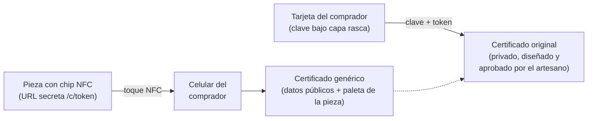
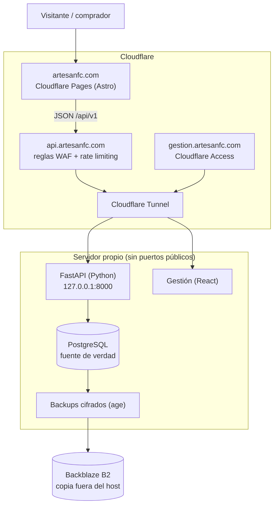

# ArtesaNFC — resumen ejecutivo

Panorama de 3 minutos del proyecto: qué problema resuelve, cómo funciona,
qué está construido y en producción hoy, y qué falta. Está pensado para
revisores que no necesariamente conocen el código. Cada afirmación remite al
documento del repositorio que la respalda, para quien quiera verificarla.

**Corte:** 2026-10-07 · **Código:** `main` `4180818` (producción: release R29,
desplegado el 2026-10-06) · **Sitio:** [artesanfc.com](https://artesanfc.com)

Documentos relacionados: `DOCUMENTACION_TECNICA.md` (todo, módulo por
módulo), `README.md` (estado por área), `ARCHITECTURE.md`
(topología), `SECURITY.md` (modelo de amenazas y controles), `DECISIONS.md`
(30 decisiones de arquitectura registradas), `OPERATIONS.md`,
`DEPLOYMENT.md` y `BACKUP.md` (operación real en producción).

---

## 1. El problema

Una pieza artesanal oaxaqueña (por ejemplo, una máscara tallada en
Cuilápam de Guerrero) compite en el punto de venta contra réplicas
industriales. El comprador no tiene forma rápida de distinguir una de
otra, así que regatea hacia el precio de la copia. El artesano pierde
ingreso, reconocimiento y mercado.

No falta talento: **falta una forma confiable de demostrar el origen de la
pieza justo donde se decide la compra.**

## 2. La propuesta

Cada pieza lleva un chip **NFC** (con QR como alternativa). Al acercar el
celular se abre el **certificado** de esa pieza y de ninguna otra: quién la
hizo, de qué comunidad, con qué materiales y proceso, y su historia. Además,
el sitio público presenta a los artesanos y sus piezas como obras únicas,
no como catálogo de producción masiva.

El certificado no dice "auténtico" sin más: **muestra la evidencia**
registrada por el equipo y aprobada por el artesano.

## 3. Cómo funciona (vista del usuario)

Hay **dos factores** (`DECISIONS.md`, ADR-030):

1. **El chip** guarda una URL con un token aleatorio. Escanearlo muestra el
   certificado genérico.
2. **La tarjeta del comprador**, entregada al momento de la venta, trae una
   clave bajo capa rasca. Token + clave abren el **certificado original**,
   que el comprador puede además "reclamar" registrando un correo.

**Por qué dos factores:** el chip NTAG213 se puede clonar (ver §6). Con este
diseño, un clon solo muestra el certificado genérico de una pieza real; el
certificado original exige la tarjeta, que nunca está grabada en la pieza.

## 4. Arquitectura

| Capa | Tecnología | Función |
|---|---|---|
| Sitio público | Astro estático en Cloudflare Pages | Home, artesanos, piezas, certificado |
| API | FastAPI + SQLAlchemy + Alembic | Catálogo público, resolución de certificados, API de Gestión |
| Datos | PostgreSQL | Artesanos, piezas, certificados, tags NFC, auditoría |
| Gestión | React/Vite detrás de Cloudflare Access | Captura de contenido, media, certificación, grabado NFC |
| Borde | Cloudflare (TLS, reglas, Tunnel) | El servidor nunca se expone directamente a Internet |
| Finanzas | FastAPI + SQLite + React (repo aparte) | Libro contable, facturas y presupuesto del proyecto |

**Decisiones de diseño que importan** (cada una con su ADR):

- **Sitio y API separados** (ADR-017, ADR-018): el frontend estático sigue
  disponible aunque el servidor caiga; solo se detiene lo dinámico.
- **La API es la única autoridad de publicación** (hallazgo F-08): ningún
  frontend contiene páginas fijas por pieza, así que un borrador o una pieza
  retirada no puede filtrarse por una copia estática olvidada.
- **Sin dependencias ni infraestructura innecesaria**: ni blockchain, ni
  criptografía casera, ni editor de diseño propio; se usan primitivas
  estándar (`secrets`, `hashlib.scrypt`, SHA-256) y servicios existentes.

## 5. Seguridad

El diseño parte de un **modelo de amenazas explícito** (`SECURITY.md` §1) y
declara por escrito lo que *no* garantiza (§19), para no prometer de más.

| Control | Detalle |
|---|---|
| Token del certificado | 256 bits del CSPRNG del sistema, Base64url (43 caracteres). Solo se guarda su hash; el token en claro nunca se persiste |
| Identificadores separados | `id` de la pieza ≠ código público ≠ UID del chip ≠ token. El UID del NFC no es secreto ni factor de autenticación |
| Anti-enumeración | Un token inválido, revocado o inexistente reciben la misma respuesta; certificados fuera del sitemap y con `noindex` |
| Rate limiting | Cloudflare: 10 solicitudes / 10 s por IP sobre la resolución de certificados (verificado: la 11.ª recibe `429`) |
| Clave de la tarjeta | 50 bits, hash `scrypt` con sal por clave, límite de intentos por certificado y por IP, bloqueo temporal |
| Gestión | Detrás de Cloudflare Access; roles Editor / Diseñador / Custodio validados en el servidor; acciones auditadas |
| Superficie de la API | Solo `/api/v1/*` y `GET|HEAD /media/*` son alcanzables; `/docs` y `/openapi.json` deshabilitados en producción |

## 6. Limitaciones conocidas (declaradas, no ocultas)

- **El NTAG213 se puede clonar.** No tiene criptografía anti-clonado; el
  sistema no afirma lo contrario. La mitigación actual es el segundo factor
  (tarjeta). La solución de fondo es migrar a **NTAG 424 DNA** (firma
  dinámica por escaneo, SUN/CMAC), evaluada para después del piloto.
- **El certificado acredita procedencia, no propiedad legal** (ADR-010), y
  no sustituye un peritaje experto: es tan confiable como el proceso de
  registro que lo respalda.
- **El grabado de chips desde Gestión** usa Web NFC, que hoy solo funciona
  en Chrome para Android. La herramienta de línea de comandos queda como
  respaldo.

## 7. Estado actual

| Área | Estado |
|---|---|
| Sitio público (Astro) | En producción desde 2026-10-03 |
| API pública y certificados | En producción, controles de borde verificados externamente |
| Gestión (contenido, media, certificación v2, ventas, autorización del artesano) | En producción |
| Despliegue | Releases inmutables y verificables, construidos por CI; 29 releases a la fecha (R29) |
| Respaldos | Diarios, cifrados, con copia fuera del host y simulacros de restauración |
| Piloto (máscara de Cuilápam) | En preparación: contenido capturado, flujo completo listo |

**Resiliencia medida, no supuesta** (`BACKUP.md` §15): en el simulacro del
2026-10-05 se reconstruyó el servicio en un host nuevo desde la copia
remota cifrada en **~7 minutos de trabajo efectivo** (objetivo: 4 h), con
los conteos de las 20 tablas idénticos al manifiesto del respaldo.
Pérdida máxima de datos aceptada (RPO): 24 h.

**Proceso de ingeniería:**

- 342 commits y 238 pull requests desde el 2026-09-02, flujo por Issues → rama → PR → `develop`
  → `main` solo para releases aprobados.
- 1,199 pruebas automatizadas en el backend y 59 en el sitio público (19
  unitarias y 40 de navegador); 5 flujos de CI (backend, web, Gestión, releases, auditoría semanal
  de dependencias).
- 30 decisiones de arquitectura registradas con contexto, alternativas
  descartadas y riesgos residuales.
- Sprints 0–4 cerrados con QA documentado (`SPRINT_*.md`).

## 8. Siguientes pasos

1. **Piloto de punta a punta** con la máscara de Cuilápam: pieza publicada,
   certificado original aprobado por el artesano, chip embebido en la
   pieza, tarjeta entregada al comprador.
2. **Medir**: escaneos por pieza, desbloqueos del certificado original y
   ventas, para responder la pregunta del proyecto: *¿conocer la historia
   verificable de la pieza cambia la decisión de compra?*
3. Evaluar **NTAG 424 DNA** con los resultados del piloto.
4. Formalización: constitución de la S.A.S. y registro de marca ante el IMPI.

---

*Proyecto de Ingeniería en Innovación Tecnológica · FASBIT-UABJO.*
